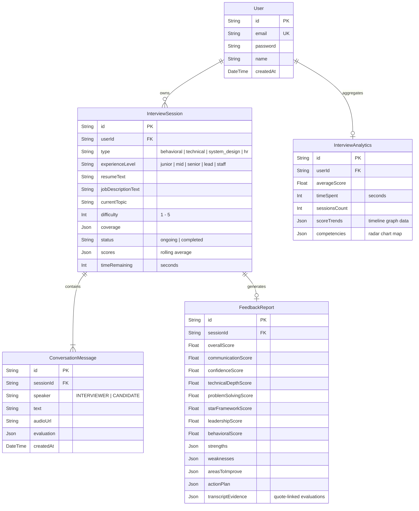

# Intrvyu AI - Voice Mock Interview Platform

Intrvyu AI is a production-grade, full-stack, AI-powered mock interview platform that simulates natural, low-latency, two-way verbal conversations. Powered by the **Google Gemini Live API** (via Google AI Studio) and a custom **LangGraph** state machine backend, the platform evaluates candidates across distinct professional personas, dynamically adjusts difficulty, maps subject coverage, and compiles detailed SaaS-style feedback reports with analytics dashboards.

### 🌐 [🚀 Live Demo: intrvyu-ai.vercel.app](https://intrvyu-ai.vercel.app/)

---

## 🛡️ Badges & Tech Stack


---

## 📌 Table of Contents

- [Key Features](#-key-features)
- [How to Use](#-how-to-use)
- [Architecture Overview](#-architecture-overview)
- [System Flows](#-system-flows)
  - [1. Gemini Live Bidirectional WS Stream](#1-gemini-live-bidirectional-ws-stream)
  - [2. LangGraph Interview Pipeline](#2-langgraph-interview-pipeline)
- [Database Schema (Prisma)](#-database-schema-prisma)
- [Folder Structure](#-folder-structure)
- [API Documentation](#-api-documentation)

---

## ✨ Key Features

1. **Low-Latency Duplex Voice Simulation**: Streams raw 16kHz/24kHz PCM chunks via WebSocket to Google's Gemini Live API, achieving sub-second verbal conversation loop times.
2. **Conversational Interruption Handling**: Instantly detects when a candidate speaks while the AI is talking, sending an interruption signal to cancel ongoing audio generation immediately.
3. **LangGraph State Engine**: Orchestrates the conversation state after every response using a structured state machine:
   - **Evaluation**: Performs immediate qualitative and quantitative assessment of candidate answers.
   - **Dynamic Difficulty**: Scales questions from Level 1 to 5 dynamically based on performance.
   - **Topic Coverage Tracker**: Monitors coverage status of core competencies.
   - **Follow-up Decision**: Intelligently decides to double-down on weak points or pivot to a new topic.
4. **Interactive Dashboard & Radar Chart**: Displays score trends and competence levels (Confidence, Communication, Problem Solving, Technical Depth, Leadership) via responsive UI charts.
5. **SaaS Feedback Reports**: Generates in-depth reviews containing strengths, weaknesses, recommended actions, and specific timestamped transcript evidence.
6. **Curated Professional Personas**: Provides tailored interview tracks (Technical, Behavioral, System Design, HR) with dedicated voice profiles and rubrics.

---

## 🏛️ Architecture Overview

The system is split into a **Next.js frontend** and an **Express.js backend**. The backend functions as both a REST API and a secure WebSocket Proxy that connects the client to Google's Gemini Live API while executing a **LangGraph State Machine** on every completed answer.

```
                          +---------------------------------------+
                          |        Frontend (Next.js 15)          |
                          |  - Web Audio API (PCM 16k/24k)        |
                          |  - Canvas Voice Wave Ripple           |
                          +-------------------+-------------------+
                                              |
                                              | WS PCM Chunks / Control
                                              v
                          +-------------------+-------------------+
                          |        Backend (Express.js)           |
                          |  - WebSocket Proxy Client             |
                          |  - JWT / BCrypt Auth Middleware       |
                          +---------+-------------------+---------+
                                    |                   |
                     REST Queries   |                   | WS Setup / MediaChunks
                                    v                   v
                        +-----------+-----------+   +---+-------------------+
                        |    Database (Prisma)  |   |    Gemini Live API    |
                        |   - PostgreSQL        |   |   (gemini-2.0-flash)  |
                        +-----------+-----------+   +---+-------------------+
                                    ^                   |
                                    |                   | Updates State
                                    +---------+---------+
                                              |
                                              v
                                  +-----------+-----------+
                                  |    LangGraph Engine   |
                                  | - Evaluation Node     |
                                  | - Difficulty Node     |
                                  | - Coverage Node       |
                                  | - Follow-up Node      |
                                  | - Next Question Node  |
                                  +-----------------------+
```

---

## 🔄 System Flows

### 1. Gemini Live Bidirectional WS Stream

To protect developer API credentials, the client does not connect to Google Gemini directly. Instead, a Secure WebSocket Connection is made to the Express.js Backend, which proxy-pipes media:

```
[Candidate Mic] -> [Web Audio API (16kHz PCM)] --WS--> [Express Proxy] --WS--> [Gemini Live API (wss://...)]
[Candidate Speaker] <- [Web Audio API (24kHz PCM)] <-WS-- [Express Proxy] <-WS-- [Gemini Live API]
```

* **Interruption Handling**: If the candidate speaks, the frontend immediately stops playback of the interviewer's voice and sends an `interrupt` payload to the backend. The backend proxy feeds an empty turn (`turnComplete: false, parts: []`) into the Gemini WebSocket, which causes Gemini to halt its ongoing audio stream instantly.

### 2. LangGraph Interview Pipeline

Once the candidate completes their answer (signaled by a turn complete event), the backend interceptor runs the **LangGraph State Machine** to decide how to direct the conversation:

```mermaid
graph TD
    A[Start State: Candidate Answer Complete] --> B[Evaluation Node]
    B -->|Grades communication, depth, confidence| C[Difficulty Adjustment Node]
    C -->|Increments/Decrements Level 1-5| D[Coverage Tracker Node]
    D -->|Updates topic mapping probing/completed| E[Follow-up Decision Node]
    E -->|Is response weak/incorrect?| F{Decide Follow-up}
    F -->|Yes| G[Set nextAction = 'follow_up']
    F -->|No / Limit reached| H[Next Question Node]
    H -->|Select new topic or close if time limit met| I[Save Session State to DB]
    G --> I
    I --> J[Inject [SYSTEM GUIDANCE] into Gemini context]
```

- **Evaluation Node**: Inspects the prompt, interviewer's question, candidate's answer, and history. Using Gemini JSON mode, it extracts scores out of 10 and parses alignment.
- **Difficulty Adjustment Node**: Computes rolling averages. If the average of the last turn is $\ge$ 8.0, difficulty escalates. If $\le$ 4.5, difficulty drops.
- **Coverage Tracker Node**: Tracks coverage status (`not_started`, `probing`, `completed`) of core topics.
- **Follow-up Decision Node**: Decides to query further if the answer lacks depth or is incorrect. Prevents loops by capping follow-ups per topic to 4.
- **Next Question Node**: Shifts the interview track to the next incomplete topic. If all topics are covered or time has run out, transitions status to `completed` and launches the final feedback generator.

---

## 🗄️ Database Schema (Prisma)

Relational schema designed for Postgres to track sessions, transcripts, and aggregated competency charts.



---

## 📂 Folder Structure

```
Intrvyu AI/
├── backend/
│   ├── src/
│   │   ├── controllers/      # REST endpoint handlers (auth, sessions)
│   │   ├── db/               # Prisma client connection singletons
│   │   ├── graph/            # LangGraph state machine node operations
│   │   │   ├── prompts/      # Personas instructions, evaluations, reports
│   │   │   ├── state/        # State schema definition interfaces
│   │   │   └── graphEngine.ts # LangGraph pipeline coordinator
│   │   ├── middleware/       # JWT Auth verification
│   │   ├── routes/           # Router endpoints for auth & interviews
│   │   ├── services/         # Gemini Live and REST utility services
│   │   └── server.ts         # Express server setup & WS upgrade proxy listener
│   ├── prisma/               # Database definitions & migrations
│   ├── tsconfig.json         # Backend ESM setup
│   └── package.json          # Backend dependencies
├── frontend/
│   ├── app/                  # Next.js App Router (dashboard, auth, room)
│   ├── hooks/                # Audio capture & WebSocket hooks (useAudioLive)
│   ├── services/             # API network calls wrapper
│   ├── store/                # Zustand client state stores (auth)
│   ├── types/                # Shared TypeScript structures
│   ├── tailwind.config.ts    # Custom UI theme styling rules
│   └── package.json          # Frontend dependencies
```

---

## 🔌 API Documentation

All REST routes are prefixed with `/api`. Authenticated routes require a `Bearer <JWT_TOKEN>` header.

### 🔐 Authentication
* **`POST /api/auth/signup`**: Creates a user profile. Expects `{ email, password, name }`.
* **`POST /api/auth/login`**: Returns JWT token upon verification. Expects `{ email, password }`.

### 🎙️ Sessions & Interview Flow
* **`POST /api/interview/start`**: Starts a mock session. Expects `{ type, experienceLevel, resumeText, jobDescriptionText }`. Returns session data.
* **`POST /api/interview/end`**: Concludes the ongoing session and triggers async compilation of the AI report card. Expects `{ sessionId }`.
* **`GET /api/interview/sessions`**: Fetches all past interview sessions for the logged-in user.
* **`GET /api/interview/feedback/:id`**: Retrieves the detailed feedback report with strengths, weaknesses, and evidence logs.
* **`GET /api/interview/profile`**: Retreives overall analytics, score trends, and competency scores for charts.

---

## 💡 How to Use

Experience a realistic, high-fidelity AI mock interview in a few simple steps:

1. **Sign Up & Authentication**: Create a secure account via the registration portal or log in with your credentials to access your personalized candidate dashboard.
2. **Setup Your Profile & Interview Parameters**:
   - Select your interview track: **Technical**, **Behavioral**, **System Design**, or **HR**.
   - Choose your target experience level: **Junior**, **Mid-level**, **Senior**, **Lead**, or **Staff**.
   - *(Optional)* Copy-paste your resume content and the job description of your target role. The AI customizes the questions specifically to your profile and target job context.
3. **Enter the Interview Room**:
   - Allow browser microphone permissions when prompted.
   - Click the microphone to unmute and start the session. The AI interviewer will greet you and ask the first question.
4. **Natural Spoken Interaction**:
   - Talk naturally as you would in a real interview.
   - The interactive canvas visualizes your voice inputs and the interviewer's speech waves in real time.
   - Interrupt the interviewer at any time by speaking; the interviewer will stop speaking immediately and listen to your answer.
5. **Session Feedback & Deep Analytics**:
   - Once the interview duration ends or you choose to conclude the session, the AI backend compiles a comprehensive SaaS-style feedback report.
   - Review your scorecard, which breaks down communication, technical depth, problem-solving, confidence, and leadership abilities.
   - Explore strengths, weaknesses, a step-by-step action plan, and transcript evidence quoting exactly where you excelled or need improvement.
   - Track your mock interview progress and score trends over time on your dashboard.

